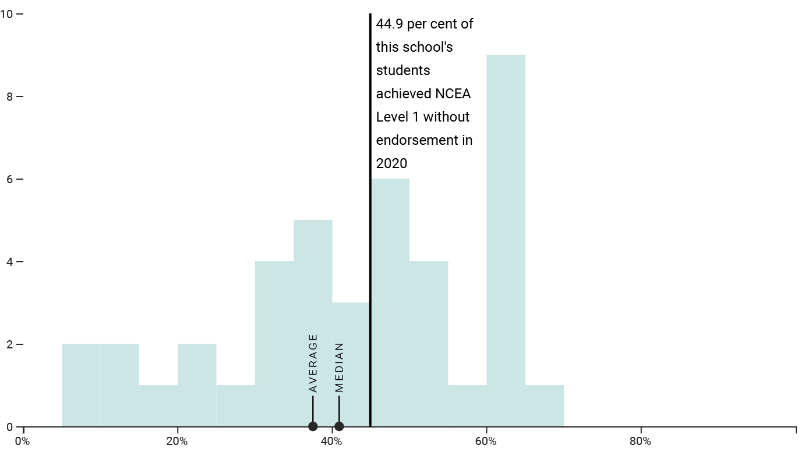

# UNICEF BR

## School Report 

#### Aug 2021, stuff.co.nz
#### Stack:
- Server-side rendering
  - Templating with Handlebars.js
- Interactive charts
  - d3.js

[link](https://interactives.stuff.co.nz/school-report/)

## In Honour

#### May 2020, stuff.co.nz
#### Stack:
- Server-side rendering
  - Templating with Handlebars.js
- Searchable database
  - d3.js

[link](https://interactives.stuff.co.nz/2020/in-honour/)

## 2018 Election results 

#### Nov 2018, vtdigger.org
#### Stack:
- Single page application
  - React
- Interactive charts
  - React + d3.js

[link](http://elections.vtdigger.org)

## Vermont schools vaccination

#### May 2019, vtdigger.org
#### Stack:
- Dynamically loaded data
- Interactive charts
  - React

[link](https://vtdigger.org/2019/05/27/school-vaccination-rate/)
